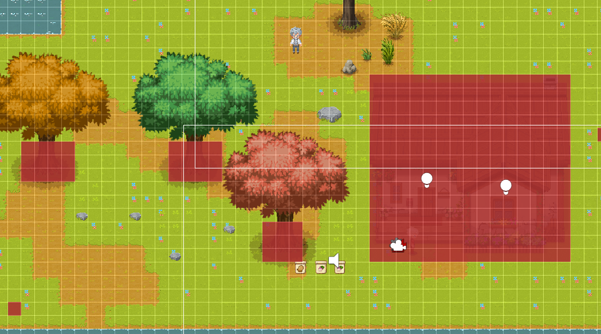
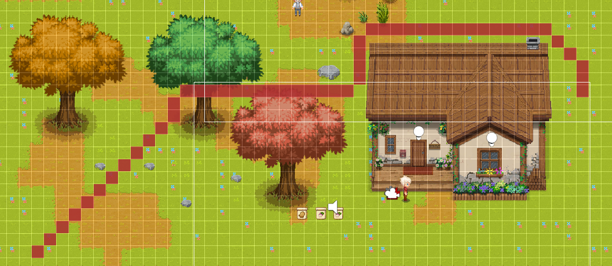
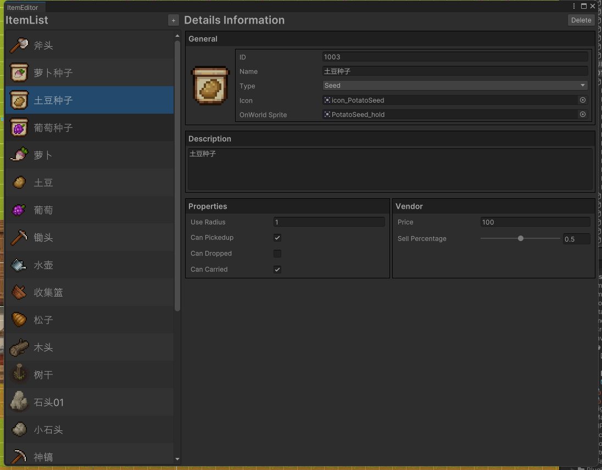

# 类星露谷物语模拟经营游戏

## 简介
2D像素模拟经营类游戏，有背包商店箱子系统，作物生长系统，建造系统，对话系统，多进度通用存储系统。
数据存储：使用UI Toolkit配置、ScriptableObject存储物品数据，通过Json序列话和反序列化实现存档系统
核心系统：通过Tilemap实现地图信息系统，在此基础上实现了作物种植和建造系统，并将地图瓦片信息存储到ScriptableObject中
AStar寻路：通过Astar寻路算法自动计算NPC的行走路径，结合时间系统实现NPC的自动行走
利用对象池管理掉落物品，应用观察者模式，定义事件中心，提供事件的监听和触发的方法，通过BlendTree实现移动动画混合，使用Animator Override实现动画状态机复用

## 种植系统

## 放置建造物品

## 对话系统

## 交易系统

## AStar 寻路
下图红色区域为NPC无法通过的地块

下图红色区域为行走路线

## UI Toolkit 制作的物品编辑器

